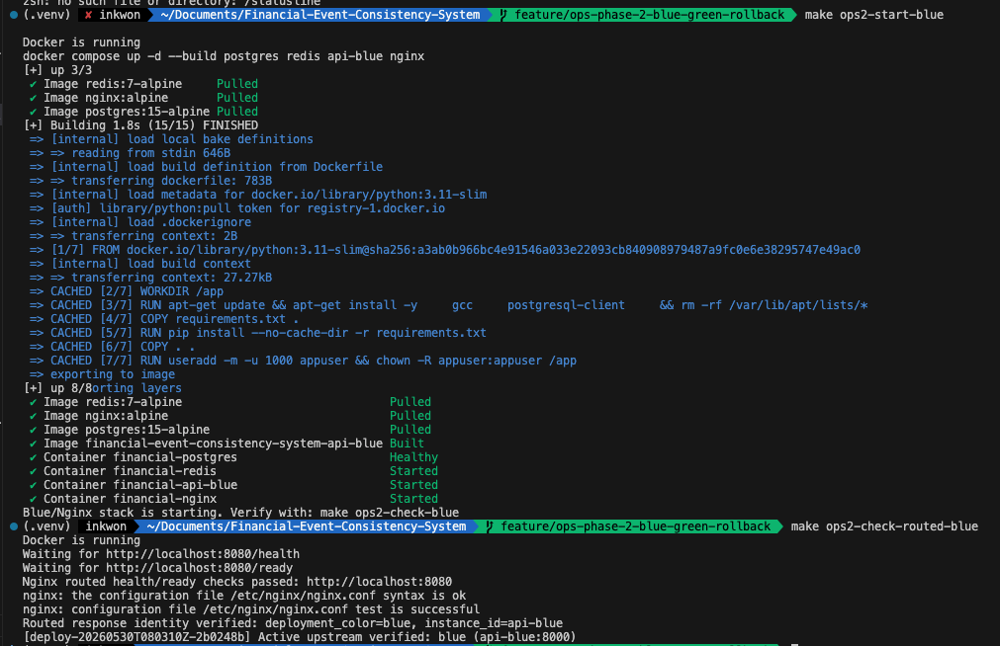
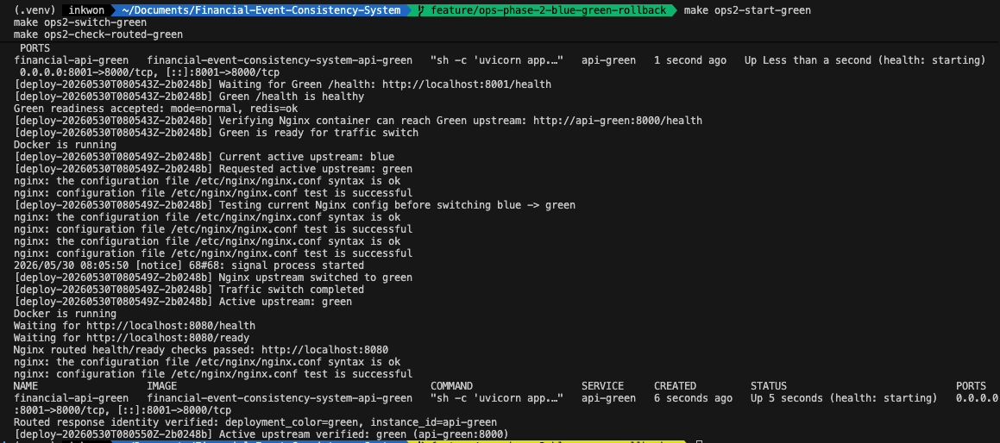
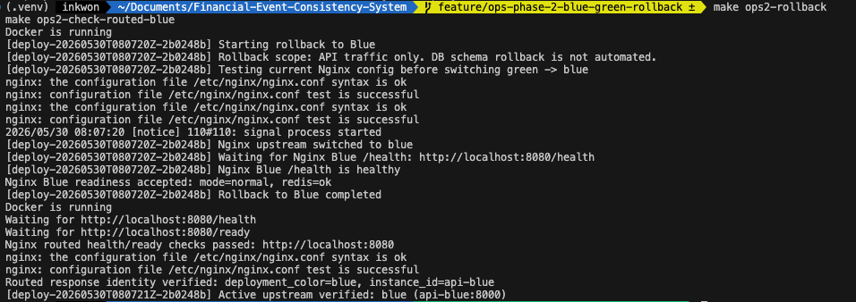
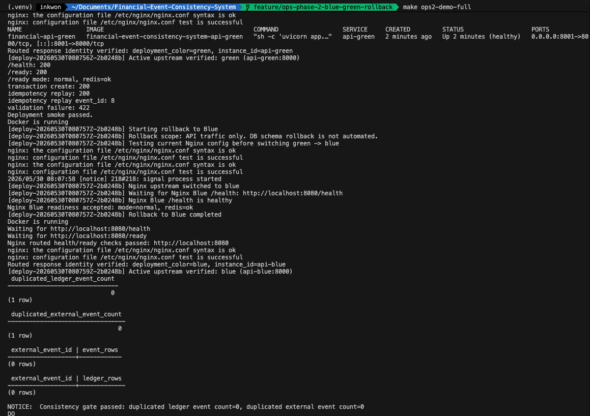

# 11편. Blue-Green 배포와 Rollback 시뮬레이션

## 1. 문제를 어떻게 정의했는가

CI Gate를 통과한 코드라도 바로 운영 트래픽에 노출하면 위험하다. 금융 이벤트 처리 시스템에서는 배포 중에도 같은 이벤트가 두 번 반영되면 안 되고, 잘못된 상태 전이가 새 버전에서 발생하면 즉시 이전 버전으로 되돌릴 수 있어야 한다.

그래서 Phase 12에서는 배포를 "컨테이너를 새로 띄우는 일"이 아니라 다음 절차로 정의했다.

1. 기존 Blue는 계속 트래픽을 받는다.
2. Green을 별도로 띄운다.
3. Green의 `/health`, `/ready`, smoke test를 먼저 검증한다.
4. Nginx 설정을 검증한 뒤 upstream만 Green으로 바꾼다.
5. 전환 후 다시 smoke와 정합성 검증을 실행한다.
6. 문제가 생기면 DB를 되돌리는 것이 아니라 API traffic만 Blue로 되돌린다.

## 2. 처음 세운 가설

처음에는 Nginx upstream을 Blue에서 Green으로 바꾸고 reload하면 충분하다고 생각했다.

하지만 실제 배포 스크립트를 만들면서 전환보다 중요한 것은 실패했을 때의 복구라는 점이 드러났다. Green이 준비되지 않았거나, Nginx config test는 통과했지만 reload가 실패하거나, host port와 container port를 혼동하면 전환은 성공한 것처럼 보이지만 실제 트래픽은 실패할 수 있다.

## 3. 구현한 구조

Docker Compose에는 `api-blue`, `api-green`, `nginx`가 있다.

```text
외부 요청
  -> localhost:8080
  -> nginx
  -> api-blue:8000 또는 api-green:8000
```

Green은 사람이 직접 확인하기 위해 host `8001`로 노출하지만, 컨테이너 내부에서는 Blue와 동일하게 `8000`으로 listen한다.

```text
host -> localhost:8001 -> api-green container:8000
nginx container -> http://api-green:8000
```

Nginx는 `nginx.conf` 전체를 sed로 수정하지 않는다. 대신 active upstream snippet만 교체한다.

```text
infra/nginx/conf.d/upstream-active.conf
infra/nginx/conf.d/upstream-active.conf.blue
infra/nginx/conf.d/upstream-active.conf.green
```

전환 스크립트는 별도 명령으로도 실행할 수 있다.

```bash
scripts/switch_traffic.sh green
scripts/switch_traffic.sh blue
```

이 스크립트는 `blue` 또는 `green` 외의 인자를 받으면 실패한다.
전환 전 현재 active upstream을 출력하고, 변경 후 `nginx -t`가 성공할 때만 reload한다.

## 4. 어떻게 재현했는가

배포 흐름은 Makefile 명령으로 고정했다.

```bash
make local-bg
make deploy-status
make deploy-green
make deploy-switch-green
make deploy-smoke
make deploy-rollback
make deploy-verify
```

전체 전환과 rollback 흐름은 한 번에 실행할 수 있다.

```bash
make phase12-check
```

이 명령은 Green 실행, Green smoke, Nginx Green 전환, 전환 후 smoke, Blue rollback, rollback 후 smoke, PostgreSQL 정합성 검증까지 실행한다.

Ops Phase 2에서는 같은 흐름을 운영자가 단계별로 더 명확하게 실행할 수 있도록 `ops2-*` 명령을 추가했다.

```bash
make ops2-start-blue
make ops2-check-blue
make ops2-start-green
make ops2-check-green
make ops2-smoke-green
make ops2-switch-green
make ops2-check-routed-green
make ops2-smoke-routed
make ops2-rollback
make ops2-demo
```

`deploy-*` 명령은 Phase 12의 통합 배포 시뮬레이션에 가깝고, `ops2-*` 명령은 장애 훈련이나 운영 리허설에서 각 단계를 끊어서 확인하기 위한 진입점이다.
예를 들어 `ops2-start-green`은 Green을 띄우고 직접 endpoint와 Nginx 내부 접근을 검증하지만 아직 traffic switch는 하지 않는다.
`ops2-switch-green`은 Green 검증이 끝났다는 전제에서 Nginx upstream만 전환한다.
전환 이후에는 `ops2-check-routed-green`으로 active color, upstream snippet, Nginx에 로드된 config가 Green을 바라보는지 확인하고, `ops2-smoke-routed`로 Nginx 경유 거래 smoke를 다시 실행한다.
이 과정을 넣은 이유는 Green 직접 호출이 성공해도 Nginx가 여전히 Blue를 바라보는 상태라면 배포 검증이 성립하지 않기 때문이다.
최종적으로는 `/health` 응답에도 `deployment_color`와 `instance_id`를 포함해 실제 HTTP 응답이 어느 instance에서 왔는지 확인하도록 했다.

이번 단계에서 중요한 것은 Green 컨테이너를 띄운 것이 아니라, Nginx가 실제로 Green 응답을 반환하는지 증명하고, 문제가 생겼을 때 Blue로 되돌아온 사실까지 같은 방식으로 검증한 것이다.

### 4-1. 초기 Blue routed identity 확인

초기 상태에서는 Blue를 운영 트래픽의 기준으로 둔다. `make ops2-start-blue`로 Blue/Nginx/PostgreSQL/Redis를 실행한 뒤 `make ops2-check-routed-blue`로 Nginx가 `api-blue:8000`을 바라보는지 확인한다.

단순히 `/health`가 200인지 확인하는 방식으로는 Blue와 Green을 구분할 수 없다. 따라서 각 컨테이너에 `DEPLOYMENT_COLOR`, `INSTANCE_ID`를 주입하고, Nginx 경유 `/health` 응답에서 실제 응답 주체를 확인하도록 했다.



초기 상태에서는 Nginx가 Blue upstream을 바라보고 있으며, 실제 `/health` 응답도 `deployment_color=blue`, `instance_id=api-blue`로 확인된다.

## 5. 트러블슈팅 1: reload 실패 시 상태 drift

가장 위험했던 지점은 Nginx reload 실패였다.

예를 들어 파일은 Green으로 바뀌었고 `.active-color`도 Green으로 기록됐는데, 실제 Nginx reload가 실패하면 Nginx process는 여전히 Blue로 트래픽을 보낼 수 있다. 이 상태에서는 상태 파일은 Green이라고 말하지만 실제 트래픽은 Blue로 가는 drift가 생긴다.

그래서 upstream 전환은 다음 순서로 바꿨다.

1. 현재 active snippet을 backup으로 저장한다.
2. target snippet을 candidate로 만든다.
3. candidate를 active file로 교체한다.
4. `nginx -t`를 실행한다.
5. Nginx reload를 실행한다.
6. reload 실패 시 backup snippet과 active color를 이전 값으로 복구한다.

이렇게 하면 reload 실패가 발생해도 "표시 상태"와 "실제 트래픽 상태"가 어긋나는 상황을 줄일 수 있다.
Ops Phase 2의 `scripts/switch_traffic.sh`와 `scripts/rollback_to_blue.sh`도 같은 공통 함수인 `set_active_upstream`을 사용한다.
새 명령을 추가하면서 전환 로직을 다시 만들지 않은 이유는, rollback처럼 사고 가능성이 큰 로직은 한 곳에서만 관리하는 편이 안전하기 때문이다.

## 5-1. 트러블슈팅: 설정 검증과 실제 응답 검증은 다르다

처음 보완에서는 active upstream file과 `nginx -T` 출력이 Green을 바라보는지만 확인했다.
이것은 중요한 검증이지만, 실제 HTTP 요청이 Green에서 응답했다는 증거는 아니다.
Nginx 설정은 Green을 바라보지만 reload 타이밍이나 컨테이너 상태 문제로 실제 요청이 기대와 다르게 처리될 수 있기 때문이다.

그래서 API의 `/health` 응답에 배포 identity를 추가했다.

```json
{
  "status": "ok",
  "deployment_color": "green",
  "instance_id": "api-green"
}
```

Blue와 Green 컨테이너는 Docker Compose 환경변수로 서로 다른 값을 가진다.

```yaml
api-blue:
  environment:
    DEPLOYMENT_COLOR: blue
    INSTANCE_ID: api-blue

api-green:
  environment:
    DEPLOYMENT_COLOR: green
    INSTANCE_ID: api-green
```

이후 `ops2-check-routed-green`은 다음을 함께 확인한다.

1. `.active-color`가 `green`인지
2. active upstream snippet이 `api-green:8000`을 포함하는지
3. Nginx에 로드된 config가 `api-green:8000`을 포함하는지
4. Nginx 경유 `/health` 응답의 `deployment_color`가 `green`인지
5. Nginx 경유 `/health` 응답의 `instance_id`가 `api-green`인지



Green 전환 후에는 설정 파일만 확인하지 않고, Nginx 경유 `/health` 응답이 실제 `api-green`에서 반환되는지 검증했다.

이 변경으로 "설정상 Green"과 "실제 응답이 Green"을 분리해서 검증할 수 있게 됐다.

## 6. 트러블슈팅 2: host port와 container port 혼동

처음 Green을 검증할 때 host에서는 `localhost:8001`로 접근한다. 이 때문에 Nginx upstream도 `api-green:8001`로 쓰기 쉽다.

하지만 Nginx는 같은 Docker network 안에서 Green 컨테이너에 접근한다. Docker network 내부에서는 host port가 아니라 container port를 써야 한다.

최종 구조는 다음처럼 정리했다.

```yaml
api-green:
  environment:
    API_PORT: 8000
  ports:
    - "8001:8000"
```

Nginx upstream은 다음과 같다.

```nginx
upstream api_backend {
    server api-green:8000 max_fails=3 fail_timeout=30s;
    keepalive 32;
}
```

이 문제는 host에서 `localhost:8001/health`가 성공해도 Nginx가 Green에 붙지 못할 수 있다는 점 때문에 중요했다. 그래서 배포 스크립트에 Nginx 컨테이너 내부에서 Green health를 직접 확인하는 검증을 넣었다.

```bash
docker compose exec -T nginx wget -qO- http://api-green:8000/health
```

## 7. 트러블슈팅 3: Redis degraded는 배포 차단 사유가 아니다

Phase 10에서 Redis는 degraded dependency로 정의했다. PostgreSQL이 살아 있으면 Redis lock/cache가 실패해도 DB transaction과 unique constraint 기준으로 처리할 수 있다.

그런데 Docker Compose에서 Redis를 `service_healthy` hard dependency로 두면 Redis가 unhealthy일 때 Green 컨테이너 자체가 시작되지 않는다. 이는 readiness 정책과 orchestration 정책이 충돌하는 구조다.

그래서 API 컨테이너 dependency를 다음처럼 정리했다.

```yaml
depends_on:
  postgres:
    condition: service_healthy
  redis:
    condition: service_started
```

PostgreSQL은 Source of Truth이므로 hard dependency다. Redis는 최적화 계층이므로 컨테이너 시작을 막지 않고, 애플리케이션 `/ready`에서 `mode="degraded"`로 노출한다.

## 7-1. 트러블슈팅: 운영 명령이 의도하지 않은 재시작을 만들면 안 된다

`ops2-start-green`은 Blue-Green 배포의 특성상 Blue가 이미 운영 중이라는 전제가 있다.
처음에는 이 전제를 보장하기 위해 `ops2-start-green`이 내부적으로 `ops2-start-blue`를 먼저 실행하도록 구성했다.

하지만 이 구조는 Green만 검증하려던 명령이 Blue/Nginx/PostgreSQL/Redis 실행 상태까지 다시 건드릴 수 있다.
Docker Compose가 볼륨을 삭제하지는 않더라도, 운영 리허설 명령이 의도하지 않은 재시작이나 recreate 가능성을 만드는 것은 피하는 편이 낫다.

그래서 명령을 다음처럼 분리했다.

- `ops2-start-blue`: Blue/Nginx/PostgreSQL/Redis를 명시적으로 시작한다.
- `ops2-start-green`: Blue/Nginx가 실행 중인지 확인한다. 없으면 실패한다.
- `ops2-deploy-green-only`: Green만 실행하고 검증하는 내부 단계다.

이렇게 하면 Green 배포 리허설 명령이 Blue 운영 환경을 몰래 재시작하지 않는다.

## 8. 검증 결과

`make phase12-check` 실행 결과 Green 전환과 Blue rollback 흐름이 통과했다.
Ops Phase 2에서는 같은 검증을 더 작은 단계로 쪼개 `make ops2-demo`로 재현한다.

확인한 항목은 다음과 같다.

| 검증 항목 | 결과 |
|---|---|
| Green `/health` | 200 OK |
| Green `/ready` | 200 OK |
| Nginx internal `api-green:8000/health` | 200 OK |
| Nginx Green 전환 후 smoke | 통과 |
| Blue rollback 후 smoke | 통과 |
| duplicated ledger event count | 0 |
| duplicated external event count | 0 |

배포 smoke는 단순 health check가 아니라 HMAC 거래 이벤트 생성, 동일 Idempotency-Key replay, validation failure를 함께 확인한다. 따라서 Green이 "떠 있다"가 아니라 "핵심 거래 API를 처리할 수 있다"를 검증한다.

Green 전용 smoke는 다음처럼 실행한다.

```bash
make ops2-smoke-green
```

이 명령은 `BASE_URL=http://localhost:8001`로 smoke test를 실행한다.
즉, Nginx traffic switch 전에 Green이 독립적으로 거래 이벤트 API를 처리할 수 있는지 확인한다.

전환 후에는 Nginx 경유 smoke를 다시 실행한다.

```bash
make ops2-smoke-routed
```

이 검증은 `BASE_URL=http://localhost:8080`을 사용한다.
따라서 Green이 직접 호출에서는 정상이지만 Nginx 전환 후 요청 처리에 실패하는 상황을 별도로 잡을 수 있다.

Rollback도 같은 기준으로 확인한다. 이번 rollback은 DB schema rollback이 아니라 traffic rollback이다. 금융 이벤트 처리 시스템에서 DB rollback은 정합성 리스크가 크기 때문에, schema 변경은 backward-compatible migration 원칙을 따르고, 장애 발생 시에는 트래픽을 이전 Blue 인스턴스로 되돌리는 방식을 선택했다.



Rollback 이후 Nginx upstream은 다시 Blue로 전환되며, 실제 routed response identity도 `api-blue`로 복구된다.

더 무거운 정합성 검증이 필요하면 다음 명령으로 PostgreSQL 검증 SQL까지 실행한다.

```bash
make ops2-demo-full
```

이 명령은 `ops2-demo` 이후 `deploy-verify`를 실행한다.
배포 전환 중 생성된 smoke 거래 이벤트가 PostgreSQL unique constraint와 ledger 검증 기준을 깨지 않았는지 확인하기 위한 선택적 full gate다.



`ops2-demo-full`은 Blue 시작, Green 검증, Green 전환, routed smoke, Blue rollback, PostgreSQL 정합성 검증까지 한 번에 수행한다.

최종적으로 `ops2-demo-full`을 통해 Blue 시작, Green 검증, 트래픽 전환, routed smoke, Blue rollback, PostgreSQL 정합성 검증을 한 번에 재현했다. 정합성 gate에서는 중복 ledger event와 중복 external event가 모두 0건임을 확인했다.

## 9. 포기한 것

DB rollback은 자동화하지 않았다. 금융 데이터 schema rollback은 데이터 손실 위험이 크기 때문이다. Phase 12의 rollback은 API traffic rollback이다. schema 변경은 backward-compatible migration 원칙으로 관리한다.

또한 k6 peak나 duplicate storm을 기본 배포 단계에 넣지 않았다. 배포 기본 단계는 빠른 smoke와 readiness 검증으로 유지하고, heavy test는 수동 또는 릴리즈 전 Gate로 분리했다.

## 10. 남은 한계

Docker Compose 기반 Blue-Green은 운영 Kubernetes rollout과 같지 않다. service discovery, progressive traffic shifting, readiness probe, autoscaling은 별도 환경에서 다뤄야 한다.

그래도 이 시뮬레이션은 배포 전 Green 검증, Nginx 전환, reload 실패 복구, rollback 후 정합성 검증이라는 핵심 절차를 로컬에서 반복 실행할 수 있게 만든다.
