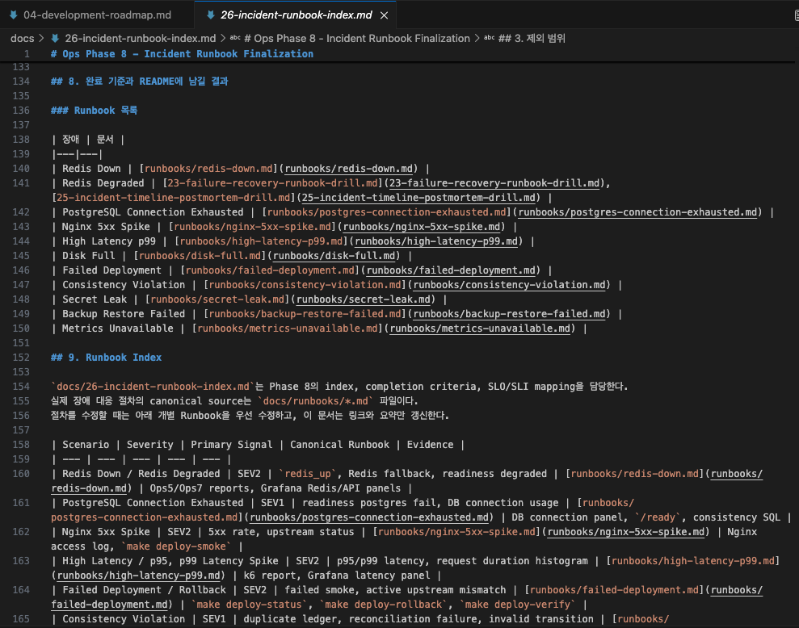
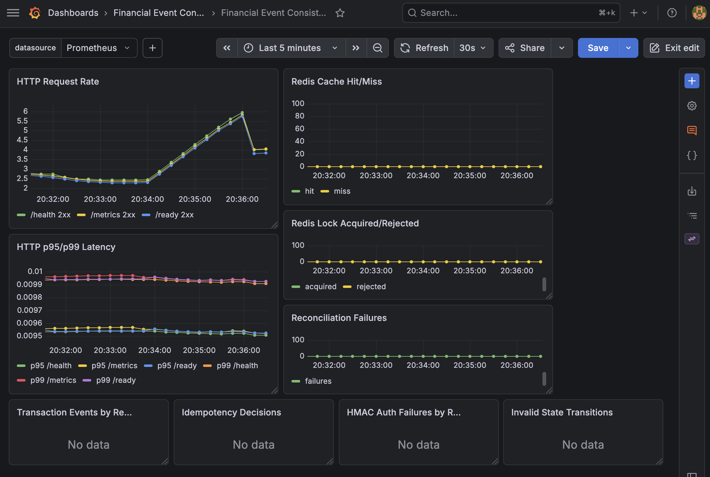
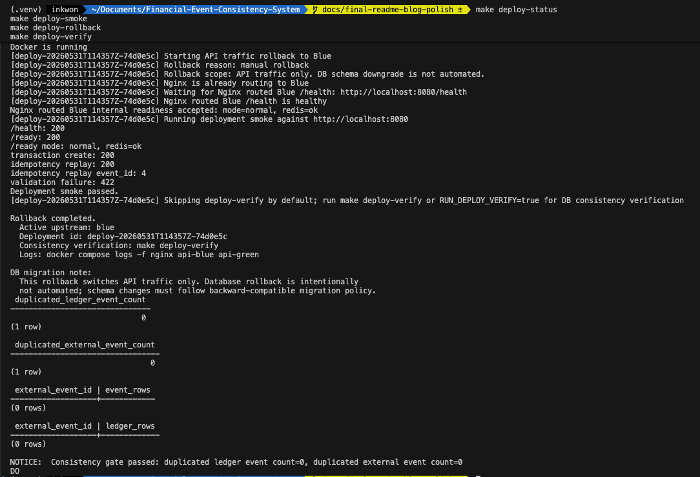

# 19편. 장애 Runbook을 작성하면서 배운 운영자의 사고방식

## 1. 문제를 어떻게 정의했는가

모니터링은 장애를 알려준다.
하지만 장애가 발생했을 때 운영자가 어떤 순서로 확인하고, 어떤 기준으로 복구 완료를 판단할지는 별도의 문서가 필요하다.

Runbook은 장애가 난 뒤 작성하는 문서가 아니라, 장애가 나기 전에 판단 순서를 고정하는 문서다.

## 2. Runbook 공통 구조

각 장애 문서는 다음 형식을 따른다.

```text
1. 장애 상황
2. 예상 원인
3. 사용자 영향
4. 탐지 방법
5. 대응 방법
6. 복구 검증
7. 재발 방지
8. README/블로그 기록 문장
9. 사후 기록 템플릿
```

이 구조를 고정하면 장애마다 문서 형식이 달라지는 문제를 줄일 수 있다.



이 캡처는 Ops Phase 8에서 Redis, PostgreSQL, Nginx, Latency, Rollback, Consistency, Secret Leak 등 장애 시나리오를 Runbook Index로 정리한 화면이다.  
`docs/26-incident-runbook-index.md`는 전체 Incident Runbook의 진입점 역할을 하고, 실제 대응 절차는 `docs/runbooks/*` 문서에서 관리한다.

## 3. Redis Down Runbook

Redis 장애는 정합성 장애가 아니다. PostgreSQL이 살아 있으면 API는 degraded mode로 처리할 수 있다.

확인할 지표는 다음과 같다.

- `financial_redis_operation_failed_total`
- `financial_redis_fallback_total`
- `financial_db_transaction_retry_total`
- p95/p99 latency

복구 기준은 Redis가 다시 살아나는 것만이 아니다. 중복 ledger가 0건인지 확인해야 한다.

## 4. DB Connection Exhaustion Runbook

PostgreSQL은 Source of Truth다. DB connection 고갈은 Redis 장애와 다르게 hard dependency 장애로 봐야 한다.

확인 순서는 다음과 같다.

1. `/ready` 실패 여부
2. active connection count
3. slow query 또는 lock wait
4. API 5xx/503 증가
5. ledger/account 정합성

## 5. Nginx 5xx Spike Runbook

Nginx 5xx는 upstream 장애, config 문제, Blue-Green 전환 실패, API readiness 실패에서 발생할 수 있다.

전환 직후라면 먼저 active upstream과 deployment status를 확인한다.

```bash
make deploy-status
make deploy-smoke
make deploy-rollback
make deploy-verify
```

DB rollback은 자동으로 하지 않는다. Phase 12 기준 rollback은 API traffic rollback이다.

## 6. p99 Latency Spike Runbook

p99만 튀는 상황은 평균 지연보다 더 어렵다. 일부 요청에서 DB lock wait, Redis fallback, Nginx upstream 지연, container throttling이 발생했을 수 있다.

그래서 p99 Runbook은 API metric에서 시작해 DB, Redis, Nginx, container resource 순서로 내려간다.
평균 latency보다 p95/p99가 장애 대응에 더 적합한 이유는 일부 느린 요청이 외부 시스템 timeout과 retry를 만들 수 있기 때문이다.



이 캡처는 k6 실행 후 Grafana에서 HTTP Request Rate와 p95/p99 Latency가 관측되는 화면이다.  
정상 운영 구간에서는 Reconciliation Failures, HMAC Auth Failures, Invalid State Transitions 같은 실패 지표가 0 또는 No data 상태로 유지되는 것이 기대 상태다.  
따라서 이 대시보드는 단순 요청량 확인이 아니라, 장애 대응 시 어떤 지표를 기준으로 판단할지 정의한 evidence로 사용한다.

## 7. Failed Deployment Runbook

Green 검증 실패는 사용자 영향 없이 멈춰야 한다. 전환 후 실패는 즉시 Blue rollback을 수행하고, rollback 후 smoke와 정합성 검증을 실행한다.

복구 완료 기준은 다음과 같다.

- active upstream이 Blue로 복구
- `/health`, `/ready` 200
- deploy-smoke 통과
- duplicate ledger/event count 0



이 캡처는 rollback 후 Nginx upstream이 Blue로 복구되고, `/health`, `/ready`, transaction create, idempotency replay smoke 검증이 모두 통과한 결과다.  
이후 PostgreSQL 기준 정합성 검증에서 duplicated ledger event와 duplicated external event가 모두 0건임을 확인했다.  
즉, 배포 복구는 단순히 컨테이너가 살아 있는지만 확인하는 것이 아니라, smoke 검증과 정합성 gate를 함께 통과해야 완료로 판단했다.

## 8. 결과 요약

Ops Phase 8에서는 새로운 장애 주입 기능을 늘리기보다, 이미 검증한 운영 흐름을 Runbook으로 묶었다.
최종 산출물은 `docs/26-incident-runbook-index.md`이며, 실제 장애 대응 절차의 canonical source는 `docs/runbooks/*.md`로 분리했다.

| 항목 | 결과 |
| --- | --- |
| Runbook 공통 구조 | 장애 상황, 원인, 영향, 탐지, 대응, 복구 검증, 재발 방지로 통일 |
| 필수 시나리오 | Redis, PostgreSQL, Nginx, latency, rollback, consistency, security incident 포함 |
| 자동화 여부 | 실제 존재하는 명령과 manual verification을 분리 |
| Supporting docs | SLO/SLI, observability evidence, measurement template과 연결 |

## 9. 남은 한계

Runbook은 실제 장애를 대신 해결하지 않는다.
하지만 장애 순간에 어떤 지표를 보고, 어떤 명령을 실행하고,
어떤 기준으로 복구를 선언할지 미리 정리해두면 대응 속도와 일관성이 크게 좋아진다.

이번 Phase에서는 실제 Slack/PagerDuty 연동이나 모든 장애의 자동 재현을 목표로 두지 않았다.
Redis degraded와 postmortem evidence는 Ops Phase 5~7에서 실제 drill로 남겼고,
PostgreSQL connection exhaustion, Nginx 5xx, Secret leak 같은 항목은 manual checklist와 planned verification을 분리했다.

## 10. Ops Phase 8에서 정리한 것

Ops Phase 8의 핵심 산출물은 `docs/26-incident-runbook-index.md`다.
이 문서에서 Redis Down/Degraded, PostgreSQL Connection Exhausted, Nginx 5xx Spike,
High Latency, Failed Deployment/Rollback, Consistency Violation, Secret Leak/Security Incident를 같은 형식으로 정리했다.

SLO/SLI 판단 기준은 `docs/29-slo-sli-error-budget.md`,
증거 수집 기준은 `docs/33-observability-evidence-plan.md`,
측정 결과 양식은 `docs/34-measurement-result-template.md`에 연결했다.

중요한 점은 실제 실행 가능한 명령과 수동 확인 항목을 섞지 않는 것이다.
이미 존재하는 `make ops5-demo`, `make ops7-demo`, `make ops2-demo`, `make deploy-rollback`은 local evidence로 남기고,
아직 자동화하지 않은 DB connection exhaustion이나 secret leak 대응은 manual checklist로 표시했다.

## 11. 마무리

이번 글에서는 Ops Phase 8 Runbook Index, Grafana request/latency dashboard,
rollback smoke와 consistency gate 결과를 함께 남겼다. Runbook은 문서만으로
끝나는 것이 아니라, 운영자가 실제 장애 대응 순간에 어떤 지표와 검증 결과를
기준으로 판단할지 보여주는 evidence와 연결되어야 한다.

이번 Phase에서 모든 장애를 자동으로 주입하는 것보다 중요하게 본 것은,
자동화된 drill과 수동 확인이 필요한 장애를 구분하는 것이었다. Redis degraded,
rollback, postmortem은 실제 명령으로 evidence를 남겼고, PostgreSQL connection
exhaustion이나 Secret leak은 운영자가 따라갈 manual checklist로 분리했다.
