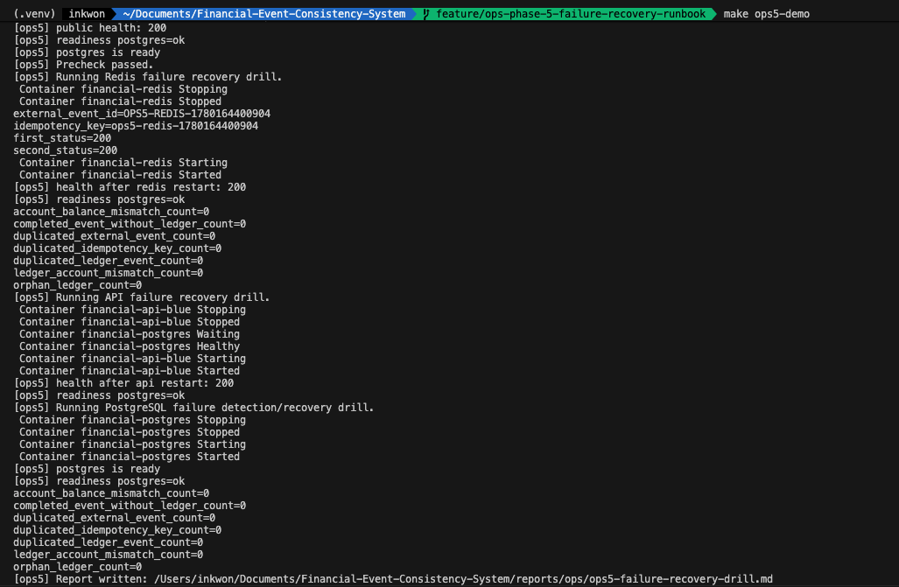
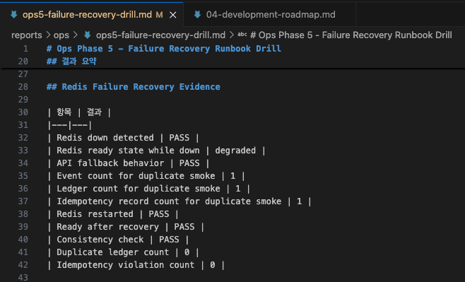
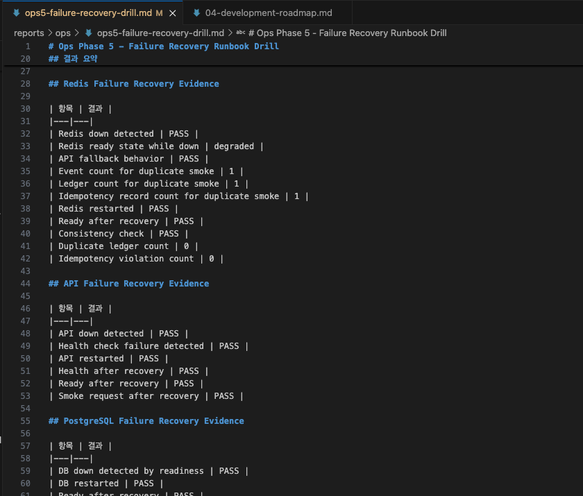
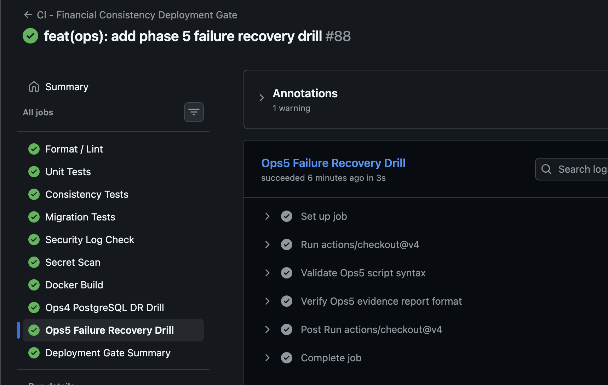

# 장애를 가정하지 않고 재현하기: Failure Recovery Runbook Drill

## 1. 왜 장애 복구 Runbook을 자동화하려고 했나

장애 대응 문서는 실제로 실행해 보기 전까지는 가정에 가깝다.
금융 이벤트 시스템에서는 특히 그렇다. Redis가 죽어도 중복 원장이 생기면 안 되고,
API가 재기동되어도 재시도 요청은 같은 결과를 받아야 하며, PostgreSQL 장애는
명확하게 readiness 실패로 드러나야 한다.

Ops Phase 5에서는 장애를 문서로만 남기지 않고, Docker Compose 환경에서
장애 주입부터 복구 후 정합성 검증까지 한 번에 실행하는 runbook drill을 만들었다.

## 2. 이번 Phase의 목표

이번 목표는 새 기능을 크게 추가하는 것이 아니라 운영 대응력을 증명하는 것이다.

```text
장애 주입
  -> 영향 확인
  -> 복구 명령 실행
  -> health/ready 확인
  -> smoke/consistency 검증
  -> Markdown evidence report 생성
```

결과는 `reports/ops/ops5-failure-recovery-drill.md`에 PASS/FAIL, duration,
count-only evidence로 기록한다.



`make ops5-demo` 실행 결과. Docker Compose 환경에서 Redis, API, PostgreSQL 장애를 순차적으로 재현하고, 복구 후 정상성·정합성 검증과 report 생성을 한 번에 수행했다.

## 3. Redis 장애 복구 Drill

Redis는 이 시스템에서 최종 정합성 저장소가 아니다.
Lock과 idempotency cache를 담당하지만, 최종 중복 방어는 PostgreSQL transaction과
unique constraint가 맡는다.

Drill은 Redis 컨테이너를 중단한 뒤 동일 거래 요청을 두 번 전송한다.
그 다음 PostgreSQL에서 event, ledger, idempotency record count가 각각 1인지
확인한다. Redis를 다시 기동한 뒤 `/ready`가 정상으로 돌아오는지도 검증한다.



Redis 장애 복구 evidence. Redis down 상태에서도 duplicate smoke 요청이 event 1건, ledger 1건, idempotency record 1건으로 유지되어 중복 원장 생성이 발생하지 않았음을 확인했다.

## 4. API 장애 복구 Drill

API 장애는 외부 시스템 재시도를 유발한다.
따라서 API 컨테이너가 내려갔을 때 `/health` 실패를 감지하고, 재기동 후
`/health`, `/ready`, smoke request가 모두 정상인지 확인한다.

복구 후 smoke request는 실제 거래 이벤트를 생성하고 같은 Idempotency-Key로
재요청한다. 이 과정에서 API가 단순히 살아 있는지뿐 아니라, 거래 처리 경로가
다시 사용 가능한지 확인한다.

## 5. PostgreSQL 장애 감지/복구 Drill

PostgreSQL은 Source of Truth라서 실험 방식이 가장 보수적이어야 한다.
이번 Phase에서는 volume 삭제나 DB 초기화를 하지 않는다. 컨테이너 stop/start만으로
장애를 재현하고, DB down 동안 `/ready`가 실패하는지 확인한다.

DB가 다시 기동되면 `/ready`가 PASS로 돌아와야 하고, 복구 후 consistency count가
모두 0이어야 한다.

장애 복구 스크립트 자체도 장애를 남기면 안 된다.
그래서 `trap cleanup EXIT`으로 이번 drill에서 중단한 Redis, API, PostgreSQL
서비스를 스크립트 종료 시 다시 기동하도록 구성했다.

## 6. 복구 후 무엇을 검증해야 하나

장애 복구에서 중요한 질문은 "컨테이너가 다시 떴는가"가 아니다.
금융 이벤트 시스템에서는 다음이 더 중요하다.

| 항목 | 이유 |
|---|---|
| health | API 프로세스가 응답 가능한지 확인 |
| ready | PostgreSQL 기준 거래 처리 가능 여부 확인 |
| smoke | 실제 거래 이벤트 처리 경로 확인 |
| consistency | 중복 event/ledger/idempotency 위반 확인 |



Failure Recovery Drill report. Redis, API, PostgreSQL 장애별로 장애 감지, 복구, health/ready, smoke, consistency check 결과를 PASS/FAIL evidence로 남겼다.

## 7. Recovery Duration을 남긴 이유

복구 절차는 가능 여부와 시간이 함께 기록되어야 한다.
이번 report는 Redis/API/PostgreSQL 각 시나리오의 recovery duration seconds와
전체 drill duration seconds를 남긴다.

이 수치는 운영 환경의 공식 RTO가 아니라, 로컬 runbook이 반복 실행 가능한지와
복구 흐름이 얼마나 명확한지를 보여주는 evidence다.

## 8. CI에 넣을 것과 로컬 Drill로 남길 것의 trade-off

컨테이너 stop/start를 포함하는 장애 주입은 CI에서 flakiness가 생길 수 있다.
runner 상태, Docker daemon 상태, 이미지 pull 시간, 네트워크 타이밍에 영향을
받기 때문이다.

그래서 이번 Phase에서는 실제 장애 주입은 로컬 운영 drill로 수행하고,
CI에서는 스크립트 문법과 커밋된 evidence report의 PASS/count/duration 형식을
검증한다.

```text
CI: bash -n, executable bit, report PASS/count/duration check
Local evidence: make ops5-demo
```



GitHub Actions에서 Ops5 Failure Recovery Drill을 배포 Gate에 포함한 결과. 실제 장애 주입은 로컬 runbook drill로 수행하고, CI에서는 스크립트 문법과 커밋된 evidence report의 PASS/count/duration 형식을 검증한다.

## 9. 이번 Phase에서 얻은 교훈

장애 대응의 핵심은 복구 명령 자체보다 복구 후 검증이다.
Redis는 다시 올라오면 끝나는 것이 아니라, 장애 중에도 PostgreSQL 기준 중복 반영이
없었는지 확인해야 한다. API는 다시 떠도 거래 smoke가 통과해야 한다.
PostgreSQL은 destructive 복구를 피하고 readiness fail/pass와 count-only
consistency evidence로 확인해야 한다.

이번 Phase를 통해 장애 대응 문서가 실행 가능한 runbook으로 바뀌었다.
