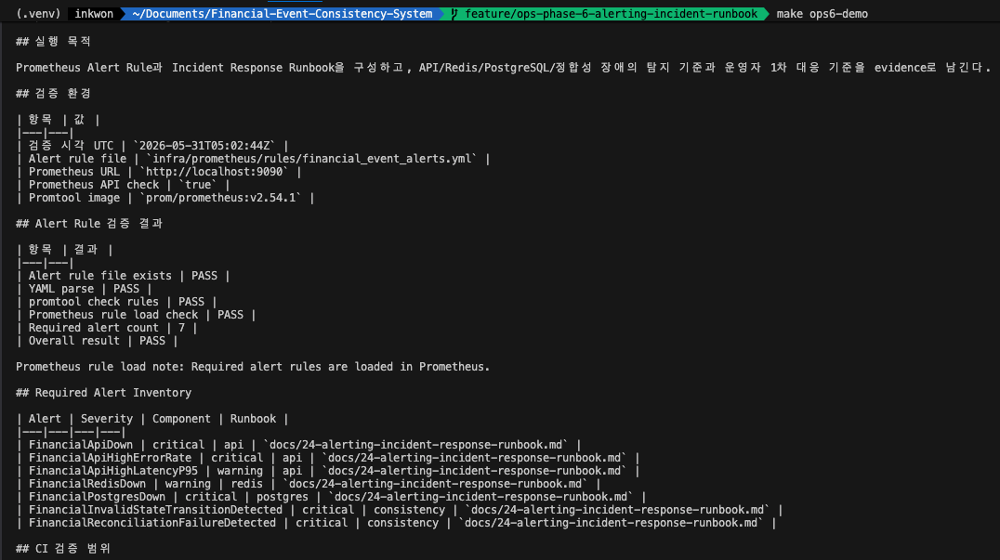
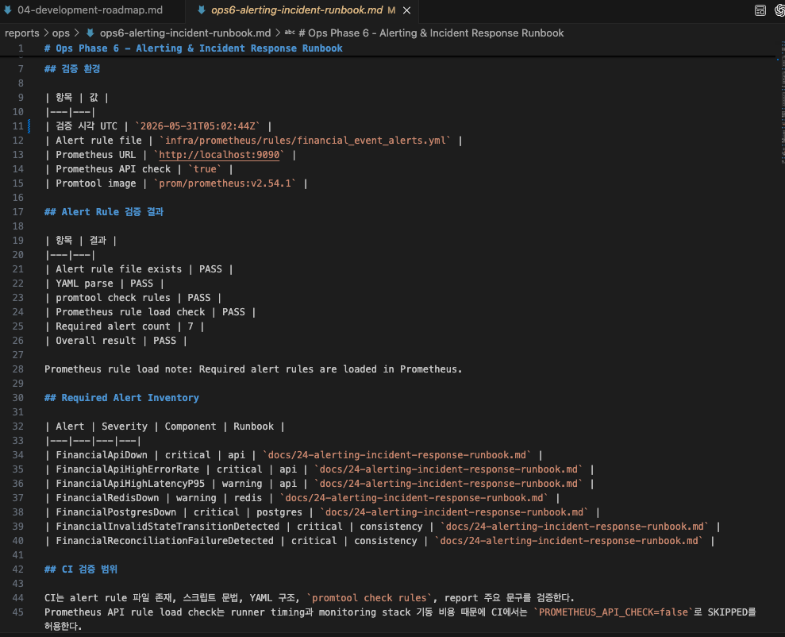
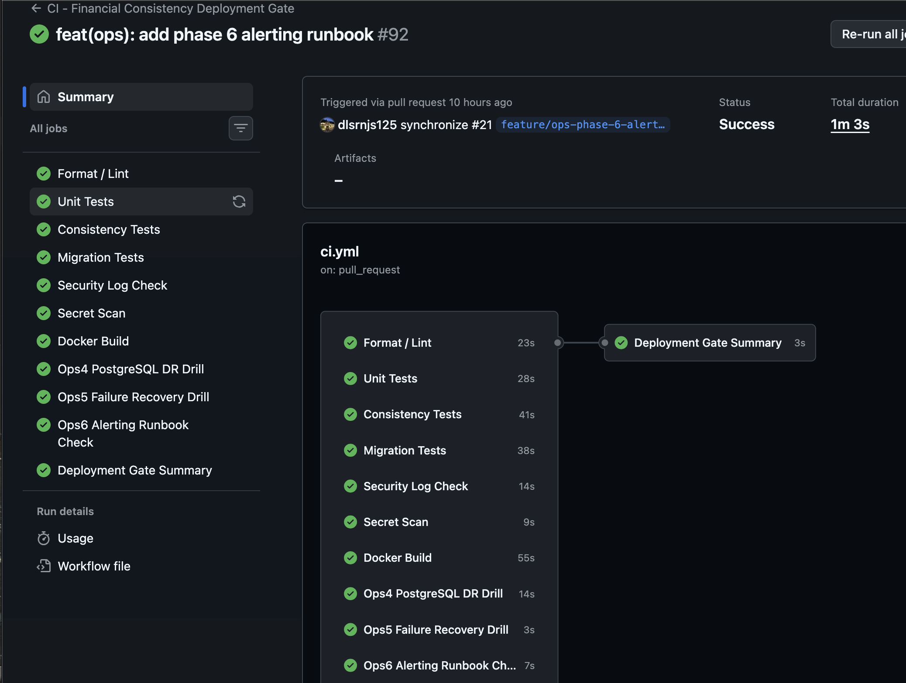

# 21편. 장애를 빨리 아는 것도 설계다: Alerting & Incident Response Runbook

## 1. 왜 장애 복구 다음 단계로 Alerting을 봤나

Ops Phase 4와 5에서는 백업 복구와 장애 복구 drill을 만들었다.
하지만 복구할 수 있다는 것만으로는 운영 대응이 완성되지 않는다.
운영자는 장애가 발생했을 때 무엇을 먼저 봐야 하는지, 어떤 상황을 warning으로 볼지,
어떤 상황을 critical로 볼지 알아야 한다.

그래서 Ops Phase 6에서는 Prometheus Alert Rule과 Incident Response Runbook을
함께 구성했다. Alert는 단순 metric threshold가 아니라 운영자가 행동할 수 있는
신호여야 한다.

## 2. 이번 Phase의 목표

이번 Phase의 목표는 다음 세 가지다.

1. API, Redis, PostgreSQL, 정합성 위험을 alert inventory로 정의한다.
2. alert마다 severity, impact, action, runbook을 연결한다.
3. CI와 로컬 검증 범위를 분리해 rule 문법과 rule load evidence를 남긴다.



`make ops6-demo` 실행 결과. Alert rule 파일 존재 여부, YAML 파싱, promtool 검증, Prometheus rule load 여부를 확인하고 Required Alert Inventory를 evidence로 남겼다.

로컬 `make ops6-demo`는 실제 Prometheus API `/api/v1/rules`를 호출해 rule load까지
확인한다. 반면 CI에서는 flakiness를 줄이기 위해 Prometheus API check를 SKIPPED로
두고, 로컬 evidence report에서 PASS를 남기는 방식으로 역할을 나눴다. 이 차이는
숨기지 않고 운영 trade-off로 문서화했다.

## 3. 어떤 장애를 Alert로 볼 것인가

이번 Phase에서 정의한 required alert는 다음이다.

| Alert | Component | 의도 |
|---|---|---|
| FinancialApiDown | api | API target down 감지 |
| FinancialApiHighErrorRate | api | 5xx 증가 감지 |
| FinancialApiHighLatencyP95 | api | p95 latency 상승 감지 |
| FinancialRedisDown | redis | Redis exporter down, Redis down, readiness degraded 감지 |
| FinancialPostgresDown | postgres | PostgreSQL down 또는 readiness failed 감지 |
| FinancialInvalidStateTransitionDetected | consistency | 금지 상태 전이 시도 감지 |
| FinancialReconciliationFailureDetected | consistency | 최근 reconciliation failure 발생 감지 |

정합성 관련 alert는 일반 availability alert보다 더 조심스럽게 다룬다.
금융 이벤트 시스템에서는 5xx보다 중복 원장이나 잔액 불일치가 더 큰 사고가 될 수 있다.

## 4. Warning과 Critical을 어떻게 나눴나

Redis down은 warning으로 두었다.
Redis는 cache/lock 계층이고 PostgreSQL이 정상이라면 최종 정합성은 유지되어야 한다.
물론 fallback 증가와 DB retry 증가는 봐야 한다. 하지만 Redis down 자체를 곧바로
데이터 정합성 사고로 보지는 않는다.

반대로 PostgreSQL down은 critical이다.
PostgreSQL은 `TransactionEvent`, `LedgerEntry`, `Account`, `IdempotencyRecord`의
Source of Truth다. PostgreSQL readiness가 실패하면 신규 금융 이벤트 처리는
정상이라고 볼 수 없다.

API down과 5xx spike도 critical로 두었다.
외부 시스템 재시도를 유발하고, idempotency와 duplicate prevention 경로에 압력을
주기 때문이다.

## 5. Prometheus Alert Rule 설계

Alert rule은 `infra/prometheus/rules/financial_event_alerts.yml`에 둔다.
기존 로컬 Compose와 Ops monitoring Compose가 모두 이 파일을 로드하도록 구성했다.
이 파일을 canonical source로 두고, Prometheus 컨테이너 내부에서는 Compose 환경에
따라 `/etc/prometheus/financial-event-alert-rules.yml` 또는
`/etc/prometheus/alert-rules.yml`로 mount한다.

각 alert는 최소한 다음 정보를 가진다.

```yaml
labels:
  severity: warning 또는 critical
  domain: financial-event
  component: api 또는 redis 또는 postgres 또는 consistency
  runbook: docs/24-alerting-incident-response-runbook.md
annotations:
  summary: 짧은 요약
  description: 운영자가 이해할 수 있는 설명
  impact: 사용자/운영/정합성 영향
  action: 1차 대응 방법
```

이 구조의 목적은 alert를 보고 바로 다음 행동으로 이어지게 만드는 것이다.
Redis alert는 `redis_up`뿐 아니라 `up{job="redis-exporter"}`도 함께 본다.
Redis exporter 자체가 내려가면 `redis_up` 시계열이 사라질 수 있기 때문이다.



Ops Phase 6 alert validation report. Alert rule 파일 존재 여부, YAML 문법, promtool 검증, Prometheus rule load check, Required Alert Inventory를 PASS/FAIL evidence로 기록했다.

정합성 alert 중 reconciliation failure는 counter의 누적값 전체를 보지 않고
`increase(financial_reconciliation_failures_total[5m]) > 0`으로 최근 발생 여부를
본다. 한 번 발생한 과거 failure가 계속 firing되는 것을 피하기 위한 선택이다.
다만 현재도 장애가 진행 중인지 표현하려면 후속 Phase에서 active gauge가 필요하다.

## 6. Incident Response Runbook 설계

Runbook은 alert별로 완전히 분리하지 않고 API, Redis, PostgreSQL, 정합성 의심
대응 흐름으로 묶었다.

Redis 장애는 Ops Phase 5의 Redis recovery drill과 연결한다.
API 장애는 health/ready/smoke 복구 확인으로 이어진다.
PostgreSQL 장애는 destructive operation을 피하고 readiness 복구 후 consistency
SQL을 실행하는 흐름으로 연결한다.

정합성 위반 의심은 별도 흐름으로 둔다.
이 경우에는 트래픽 제한, evidence 보존, count-only SQL 확인, LedgerEntry 삭제 금지
같은 금융 도메인 원칙이 우선한다.

## 7. CI에서 검증한 것과 로컬에서 검증한 것

CI에서는 다음을 검증한다.

- alert rule 파일 존재
- `scripts/ops6_alert_rule_validation.sh` 문법과 실행 권한
- YAML 구조와 required alert inventory
- `promtool check rules`
- generated report 주요 문구

반면 Prometheus API rule load check는 로컬에서 수행한다.
CI에서 monitoring stack 전체를 띄우고 rule load까지 확인하면 runner 상태와
컨테이너 기동 타이밍 때문에 flakiness가 생길 수 있기 때문이다.
따라서 CI에서 생성되는 report는 Prometheus rule load check가 SKIPPED일 수 있고,
커밋된 local evidence report는 `make ops6-demo`로 생성해 rule load check PASS를
남긴다. CI는 rule load까지 검증했다고 말하지 않고, rule 문법과 required inventory,
report 형식을 검증한다고 표현한다.



GitHub Actions에서 Ops6 Alerting Runbook Check가 Deployment Gate에 포함된 결과. CI에서는 alert rule 문법, required inventory, evidence report 형식을 검증하고, 실제 Prometheus rule load는 로컬 drill evidence로 남겼다.

Ops4, Ops5, Ops6 운영 검증 job을 Deployment Gate Summary에 함께 포함했다.
CI에서 monitoring stack 전체를 띄우고 Prometheus API load까지 강제하면 검증이
느려지고 flaky해질 수 있다. 그래서 CI는 안정적인 정적/문법/형식 검증을 맡고,
로컬 drill은 실제 Prometheus rule load PASS evidence를 남긴다. 이것은 구현 한계가
아니라 운영 검증의 안정성을 위한 분리다.

## 8. 처음 기획과 달라진 점

처음에는 기존 `infra/monitoring/prometheus/alert-rules.yml`만 수정할 수도 있었다.
하지만 기본 Compose와 monitoring override가 서로 다른 rule file mount를 사용하고
있어서, Ops6에서는 `infra/prometheus/rules/financial_event_alerts.yml`을 canonical
rule file로 두고 양쪽 Compose가 이 파일을 로드하도록 정리했다.
중복 rule 파일은 제거하고, promtool fallback Docker image도 `prom/prometheus:v2.54.1`
로 고정했다. 운영 Prometheus 버전이 바뀌면 promtool 검증 이미지도 함께 맞춰야 한다.

또한 Alertmanager, Slack, PagerDuty 연동은 제외했다.
이번 Phase의 목적은 secret이 필요한 외부 연동이 아니라, 탐지 기준과 운영 대응
기준을 재현 가능한 evidence로 남기는 것이다.

## 9. Troubleshooting

metric 이름은 문서보다 코드가 우선이다.
실제 alert expression은 `backend/app/observability/metrics.py`의 metric 이름에 맞췄다.

duplicate ledger count와 idempotency violation count는 현재 Prometheus gauge로
직접 노출하지 않는다. Ops Phase 5 report와 consistency SQL에서는 count-only
evidence로 확인하지만, Prometheus alert로 직접 감지하려면 후속 Phase에서 bounded
application gauge를 추가해야 한다.

Prometheus API rule load check가 FAIL이면 monitoring stack이 떠 있는지 먼저 확인한다.
`make ops6-up` 후 `make ops6-drill` 또는 `make ops6-demo`로 다시 확인한다.
SKIPPED는 CI처럼 `PROMETHEUS_API_CHECK=false`로 실행한 경우에만 정상이다.

## 10. 이번 Phase에서 얻은 교훈

Alerting은 단순히 알림을 많이 만드는 일이 아니다.
운영자가 실제로 행동할 수 있는 신호를 고르는 일이다.

Redis down은 warning, PostgreSQL down은 critical이라는 구분은 이 프로젝트의
핵심 설계와 연결된다. Redis는 최적화 계층이고 PostgreSQL은 Source of Truth다.
그리고 consistency violation은 일반적인 availability 장애보다 더 중요한 금융
도메인 장애로 다뤄야 한다.

## 게시 전 보강 항목

- [x] `make ops6-demo` local alert validation evidence 추가
- [x] alert validation report screenshot 추가
- [x] GitHub Actions Ops6 gate evidence 추가
- [ ] TODO: evidence needed - 최종 Velog 게시 전 Prometheus rule load PASS 이미지와 report 경로 재확인
