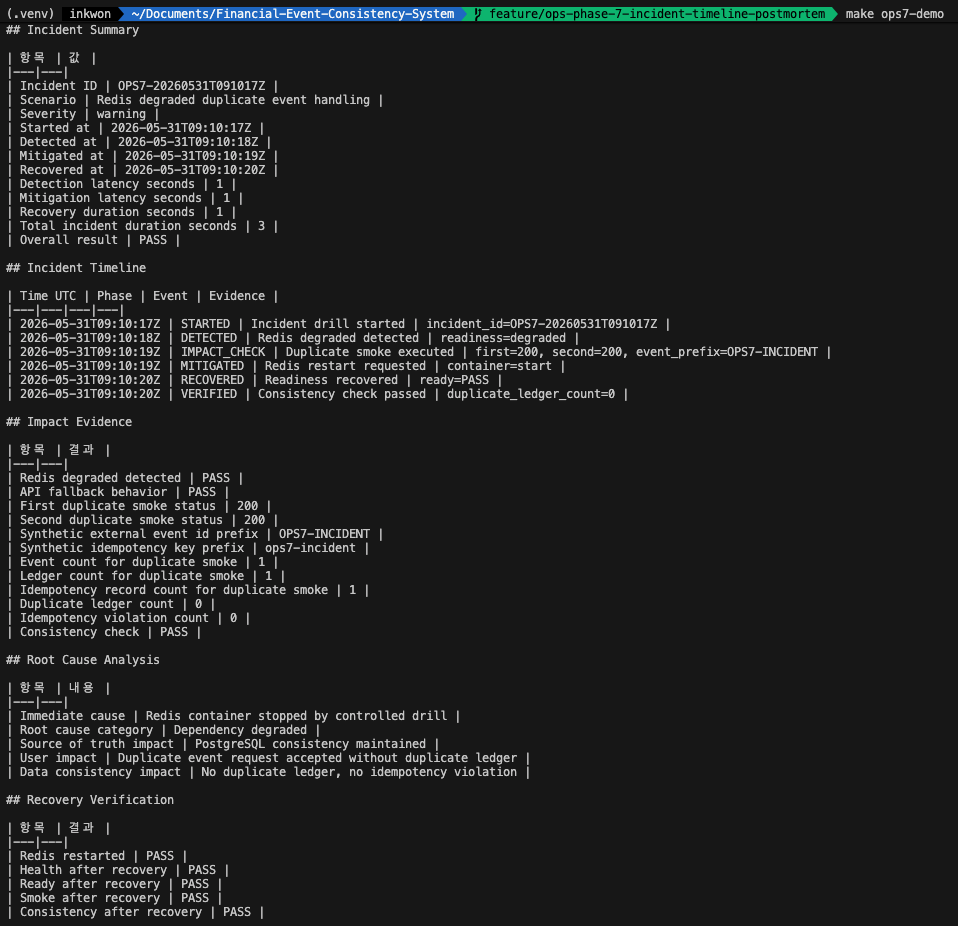
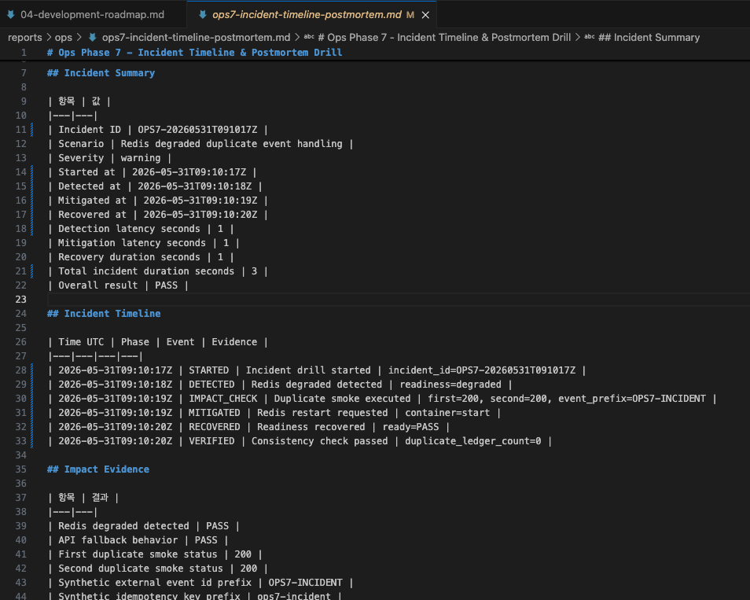
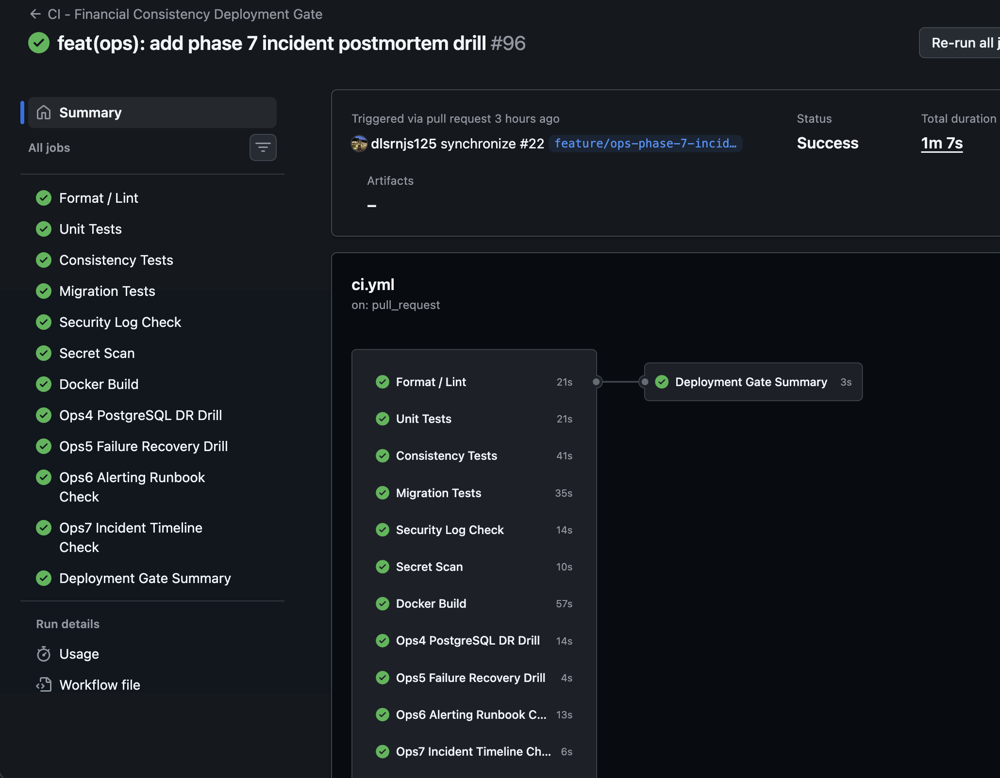

# 장애를 복구한 뒤 무엇을 남겨야 할까: Incident Timeline & Postmortem Drill

## 1. 왜 복구보다 기록이 중요한가

장애 대응에서 가장 위험한 문장은 "복구했습니다"일 수 있다.
언제 장애가 시작됐는지, 언제 탐지했는지, 어떤 영향이 있었는지, 어떤 검증으로 복구를
선언했는지 없으면 다음 장애 때 같은 질문을 다시 반복하게 된다.

Ops Phase 7에서는 복구 절차 자체보다 그 과정을 운영자가 읽을 수 있는 timeline과
postmortem evidence로 남기는 데 초점을 맞췄다.

## 2. Ops Phase 7의 목표

이번 Phase의 목표는 Redis degraded incident를 재현하고 다음 내용을 Markdown report로
남기는 것이다.

- incident started/detected/mitigated/recovered 시각
- detection latency와 recovery duration
- mitigation latency와 total incident duration
- duplicate smoke 요청 결과
- duplicate ledger count 0
- idempotency violation count 0
- recovery verification PASS
- root cause와 follow-up action item

`make ops7-demo` 실행 결과. Redis degraded incident를 재현하고, duplicate smoke 요청·복구·정합성 검증·postmortem report 생성을 한 번에 수행했다.

Ops7은 단순 장애 복구가 아니라 장애 대응 과정을 기록 가능한 evidence로 남기는 단계다.
incident started, detected, mitigated, recovered 시각을 분리하고, `Detection latency`,
`Mitigation latency`, `Recovery duration`, `Total incident duration`을 각각 기록했다.

## 3. Redis degraded incident를 선택한 이유

Redis는 이 시스템에서 cache, lock, idempotency 보조 계층이다.
Redis가 내려가면 성능과 중복 요청 완화에는 영향이 있지만, PostgreSQL이 정상이라면
최종 정합성은 유지되어야 한다.

그래서 Redis degraded는 critical이 아니라 warning 성격의 incident로 본다.
다만 warning이라고 해서 기록하지 않아도 된다는 뜻은 아니다. fallback이 증가하고 DB에
중복 요청 압력이 전달될 수 있으므로 영향 확인과 사후 기록이 필요하다.

## 4. Incident Timeline을 어떻게 설계했나

Timeline은 STARTED, DETECTED, IMPACT_CHECK, MITIGATED, RECOVERED, VERIFIED로 나눴다.

STARTED는 controlled drill 시작 시각이다.
DETECTED는 `/ready`에서 Redis degraded를 확인한 시각이다.
IMPACT_CHECK에서는 Redis down 상태에서 duplicate smoke 요청을 두 번 보낸다.
MITIGATED는 Redis restart를 요청한 시점이고, RECOVERED는 readiness가 다시 PASS가 된
시점이다.
VERIFIED는 duplicate ledger count와 consistency check가 통과한 시점이다.

Incident Timeline & Postmortem report. 장애 시작, 탐지, 완화, 복구 시각을 분리하고 Impact Evidence와 정합성 검증 결과를 함께 남겼다.

`Incident Summary`에는 장애 시각과 duration 지표를 남겼다.
`Incident Timeline`에는 STARTED, DETECTED, IMPACT_CHECK, MITIGATED, RECOVERED,
VERIFIED 단계를 남겼다. `Impact Evidence`에는 Redis degraded 상태에서도 duplicate
ledger count 0, idempotency violation count 0을 남겼다. synthetic external event id
prefix와 idempotency key prefix를 남겨 실제 row data 없이도 추적 가능한 evidence를
만들었다.

## 5. Impact Evidence는 무엇을 남겼나

Report에는 실제 거래 row data나 account_no 원문을 남기지 않는다.
대신 다음처럼 count-only evidence를 남긴다.

- first duplicate smoke status
- second duplicate smoke status
- event count for duplicate smoke
- ledger count for duplicate smoke
- idempotency record count for duplicate smoke
- duplicate ledger count
- idempotency violation count
- consistency check

추적성을 위해 synthetic external event id와 idempotency key는 원문 전체가 아니라 prefix만
남긴다. Postmortem report가 단순 PASS/FAIL 표로 끝나지 않고, 어떤 synthetic incident
smoke를 기준으로 검증했는지 따라갈 수 있게 하기 위한 장치다.

이 방식은 운영자가 영향 범위를 판단할 수 있게 하면서도 민감 데이터가 report에 들어가는
것을 막는다.

## 6. Root Cause Analysis를 어떻게 정리했나

이번 drill의 immediate cause는 Redis container를 controlled drill로 stop한 것이다.
Root cause category는 Dependency degraded로 남긴다.

Source of Truth impact는 PostgreSQL consistency maintained로 기록한다.
User impact는 duplicate event request가 수락됐지만 duplicate ledger가 생기지 않은
상태로 정리한다.

## 7. Recovery Verification 기준

복구는 container start만으로 선언하지 않는다.

- Redis restarted
- health after recovery PASS
- ready after recovery PASS
- smoke after recovery PASS
- consistency after recovery PASS

이 기준을 모두 통과해야 postmortem report의 overall result를 PASS로 둔다.

## 8. 처음 기획과 달라진 점

처음에는 CI에서도 Redis stop/start 기반 incident drill을 실행하는 것을 고려했다.
하지만 GitHub Actions runner에서 Docker Compose 서비스 stop/start를 반복하면 환경에
따라 flaky한 실패가 발생할 수 있고, 운영 incident drill의 목적과 CI Gate의 목적이
다르다고 판단했다.

따라서 실제 Redis degraded incident 재현은 로컬 `make ops7-demo` evidence로 남기고,
CI에서는 `MODE=help`, `MODE=validate-report`를 통해 스크립트 실행 가능성과 postmortem
report 형식을 검증하는 방식으로 분리했다. CI는 빠르고 안정적인 gate를 맡고, 실제
incident drill은 로컬 운영 evidence로 남긴다.

GitHub Actions에서 Ops7 Incident Timeline Check가 Deployment Gate에 포함된 결과. 실제 Redis stop/start incident drill은 로컬 evidence로 남기고, CI에서는 스크립트 실행 가능성과 postmortem report 형식을 검증했다.

이 선택은 기능 축소가 아니라 CI 안정성과 운영 evidence 신뢰성을 분리한 trade-off다.

또한 실제 Slack, PagerDuty, Jira ticket 생성은 제외했다.
이번 Phase의 목적은 외부 연동이 아니라 postmortem의 구조와 evidence 기준을 고정하는
것이다.

초기에는 recovery duration 하나만 기록하려 했지만, postmortem 관점에서는 장애를 언제
탐지했는지, 완화 조치를 언제 시작했는지, 복구가 언제 완료되었는지가 서로 다른 의미를
가진다. 그래서 `Detection latency`, `Mitigation latency`, `Recovery duration`,
`Total incident duration`을 분리했다. 이를 통해 단순히 "복구됐다"가 아니라, 탐지와
대응 과정 중 어디에서 시간이 소요되었는지 분석할 수 있게 했다.

## 9. Troubleshooting

현재 repo에는 `infra/loki`, `infra/promtail` 구성이 없다.
따라서 trace_id, request_id, event_id를 기반으로 한 완전한 log query evidence는 아직
제공하지 않는다. 이번 Phase에서는 Markdown postmortem과 count-only SQL evidence로
제한하고, 후속 Phase에서 OpenTelemetry 또는 Loki query evidence를 연결할 수 있다.

이번 Phase에서는 incident_id와 synthetic event/idempotency key prefix를 postmortem
report에 남겼지만, 실제 Loki/OpenTelemetry 기반 trace query evidence까지 연결하지는
않았다. 완전한 incident trace를 만들려면 로그 수집, trace_id 전파, Loki query,
Grafana Explore 링크까지 연결되어야 한다.

Postmortem report에는 실제 거래 row data, account_no, token, secret을 남기지 않았다.
대신 테스트용 synthetic external event id prefix와 idempotency key prefix만 남겨,
개인정보나 민감정보 없이도 어떤 incident drill을 기준으로 검증했는지 추적할 수 있도록
했다.

Drill 실패 시 script의 cleanup trap이 Redis를 다시 start한다.
그래도 readiness가 회복되지 않으면 `make ops7-up`과 `make ops7-check`로 스택 상태를
먼저 복구한다.

## 10. 이번 Phase에서 얻은 교훈

장애 대응은 복구 명령보다 기록 구조가 더 오래 남는다.
Timeline, impact evidence, root cause, recovery verification, action item이 같은
형식으로 남아야 다음 incident에서 더 빨리 판단할 수 있다.

Redis degraded는 전체 장애가 아니지만, 금융 이벤트 시스템에서는 중복 요청 압력이
PostgreSQL까지 도달할 수 있다. 그래서 warning incident라도 duplicate ledger 0건과
idempotency violation 0건을 반드시 evidence로 확인해야 한다.
