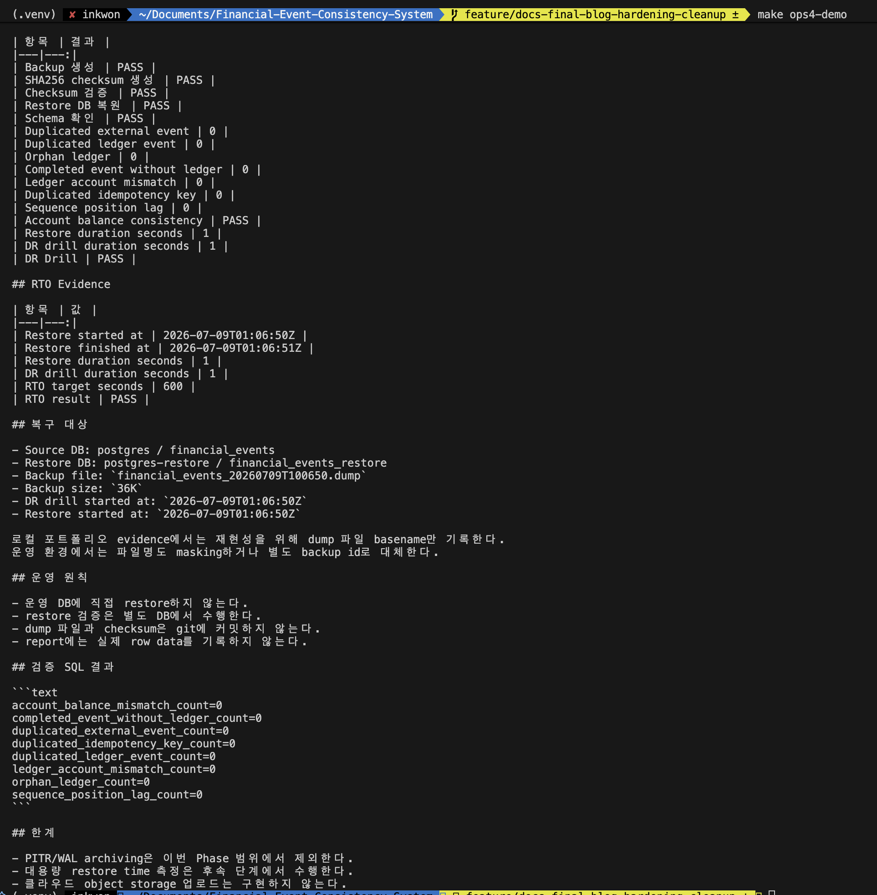

# PostgreSQL 백업은 만들어지는 것보다 복구되는 것이 중요하다

백업 파일이 있다는 사실만으로는 장애 복구가 되지 않는다. 금융 이벤트 시스템에서는 복원된 DB가 transaction event, ledger, account balance, sequence까지 일관된지 검증해야 한다.

이 글은 backup, restore, DR drill을 분리하고, 운영 DB에 직접 restore하지 않는 방식으로 PostgreSQL 복구 evidence를 만든 과정이다.

## Backup / Restore / DR Drill을 나눈 이유

세 단어는 비슷해 보이지만 의미가 다르다.

| 구분 | 의미 |
| --- | --- |
| Backup | 현재 DB 상태를 dump 파일로 남기는 것 |
| Restore | dump 파일을 별도 DB에 복원하는 것 |
| DR Drill | 복원된 DB에서 정합성 SQL과 RTO evidence까지 확인하는 것 |

백업 파일만 생성하면 "언젠가 복구할 수 있겠지"에 가깝다. DR Drill은 실제로 복구 가능한지 확인하는 절차다.

## 운영 DB에 직접 restore하지 않은 이유

복구 검증을 운영 DB에 직접 실행하면 검증 자체가 장애가 될 수 있다.

그래서 restore 전용 컨테이너와 DB를 분리했다.

```text
postgres                -> financial_events
postgres-restore        -> financial_events_restore
```

운영 DB에서 `pg_dump -Fc`로 dump를 만들고, restore DB에만 `pg_restore`를 실행한다.

```bash
make ops4-backup
make ops4-restore
make ops4-verify
make ops4-demo
```

## DR Drill 흐름

전체 흐름은 다음과 같다.

```text
pg_dump -Fc
  -> checksum 생성
  -> postgres-restore container 준비
  -> financial_events_restore DB 생성
  -> pg_restore 실행
  -> dr_consistency_check.sql 실행
  -> report 생성
```

checksum은 "파일이 만들어졌다"가 아니라 "검증 시점의 파일이 같은 파일이다"를 확인하기 위해 남긴다.



이 캡처는 `make ops4-demo` 실행 결과로, backup 생성, checksum 생성/검증, restore DB 복원, schema 확인, 정합성 SQL 검증이 모두 PASS된 상태를 보여준다.

이 프로젝트에서 DR Drill의 기준은 dump 파일 생성이 아니라, 별도 restore DB에 복원한 뒤 duplicated event, orphan ledger, balance mismatch, sequence position lag가 모두 0인지 확인하는 것이다.

## 왜 PITR이나 WAL archiving까지 구현하지 않았나

실제 운영 PostgreSQL 복구는 `pg_dump`만으로 끝나지 않는다. 장애 시점 직전까지 복구하려면 WAL archiving, Point-In-Time Recovery, replica promotion, managed backup, retention policy, backup encryption까지 함께 고려해야 한다.

하지만 이번 글의 목표는 운영용 백업 시스템을 완성하는 것이 아니었다. 목표는 "백업 파일이 존재한다"와 "복구 가능한 백업이다"를 분리하는 것이었다.

그래서 local Docker Compose 환경에서 다음 질문을 먼저 검증했다.

- dump 파일이 생성되는가
- checksum으로 손상 여부를 확인하는가
- 운영 DB가 아닌 별도 restore DB에 복원되는가
- 복원 후 schema와 constraint가 살아 있는가
- duplicated external event, orphan ledger, account balance mismatch가 모두 0인가
- restore duration을 RTO sample evidence로 남기는가

`pg_dump` 기반 DR Drill은 구현과 재현이 쉽고 포트폴리오 evidence로 적합하지만, 운영 RPO를 보장하지는 않는다. 실제 운영에서는 WAL archiving과 PITR, replica, backup retention, 접근 제어가 함께 필요하다.

즉 이 글의 DR Drill은 운영 PITR 완성이 아니라, "복구 검증을 하지 않은 백업은 증거가 아니다"라는 기준을 세운 것이다.

## restore-only와 DR Drill은 checksum 기준이 달랐다

기존 dump를 수동으로 복원하는 restore-only 경로에서는 checksum이 없으면 `SKIPPED`로 기록하고 진행할 수 있다.

하지만 DR Drill은 "복구 가능성을 증명하는 절차"다. 그래서 `make ops4-drill`과 `make ops4-demo`처럼 evidence를 남기는 흐름에서는 checksum 파일을 필수로 요구했다.

복원 명령이 성공하는 것과 DR evidence로 인정하는 기준은 다르게 둔 것이다.

## 복원 후 단순 row count만 보지 않은 이유

복원 성공은 테이블이 생겼다는 뜻일 뿐이다. 금융 이벤트 시스템에서는 다음 위반 count가 모두 0이어야 한다.

| 검증 항목 | PASS 기준 | 의미 |
| --- | ---: | --- |
| duplicated external event | 0 | 같은 외부 이벤트가 중복 저장되지 않았는가 |
| duplicated ledger reference | 0 | 하나의 이벤트에 원장이 중복 생성되지 않았는가 |
| completed event without ledger | 0 | 성공 상태인데 원장이 누락되지 않았는가 |
| orphan ledger | 0 | 이벤트 없이 원장만 남지 않았는가 |
| account balance mismatch | 0 | 계좌 잔액과 ledger 합계가 맞는가 |
| sequence position lag | 0 | 복구 후 첫 insert가 PK 충돌을 내지 않는가 |

특히 sequence position lag는 놓치기 쉽다. row data는 복구됐지만 sequence가 낮게 남아 있으면 다음 insert에서 PK 충돌이 날 수 있다.

## RTO evidence

DR Drill report에는 restore duration을 남긴다. 이것은 운영 RTO 보장을 선언하는 숫자가 아니라, local Docker Compose 환경에서 복원 흐름이 얼마나 걸렸는지 기록한 sample evidence다.

RTO를 말하려면 실제 데이터 크기, storage, network, managed DB 환경에서 다시 측정해야 한다.

## dump와 checksum을 git에 커밋하지 않은 이유

dump 파일과 checksum은 runtime artifact다. 계좌/거래 데이터가 synthetic이라도 DB dump를 repository에 커밋하는 습관은 위험하다.

그래서 report에는 다음처럼 요약 evidence만 남긴다.

- dump file path
- checksum value
- restore duration
- consistency SQL result
- PASS/FAIL summary

원본 dump는 local artifact로만 관리한다.

## 남은 한계

이 drill은 local Docker Compose 기준이다. 운영 PostgreSQL HA, point-in-time recovery, object storage backup retention, 암호화된 backup vault는 별도 운영 설계가 필요하다.

그래도 "백업 파일이 있다"에서 멈추지 않고, 별도 restore DB에서 정합성 SQL까지 통과해야 DR evidence로 인정한다는 기준을 세웠다.
