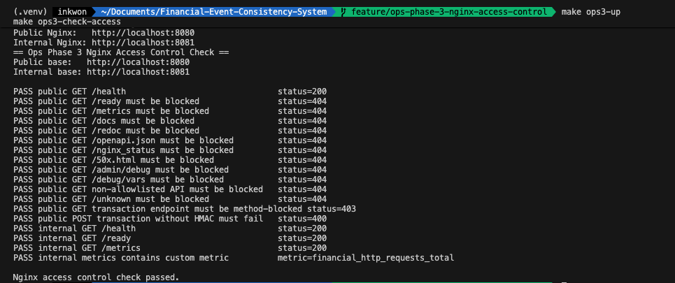
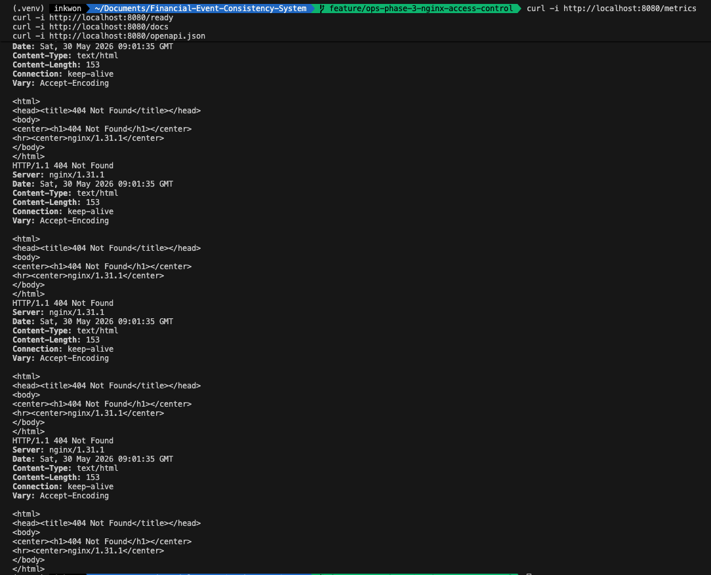
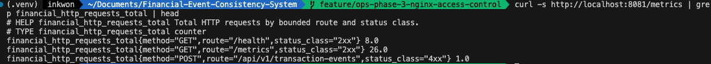
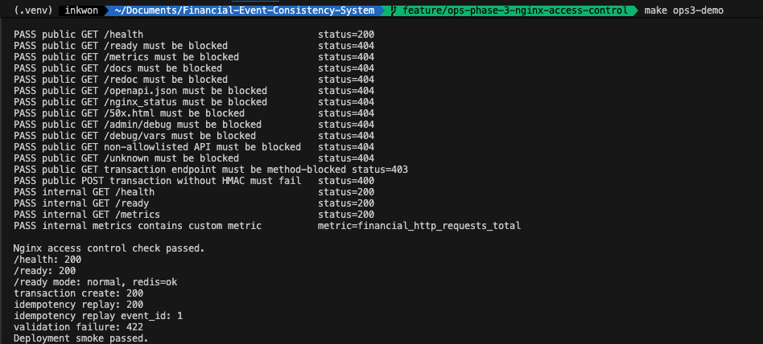

# `/metrics`와 `/ready`를 public API에서 숨긴 이유

운영 API에서 `/health`는 공개해도 되지만 `/metrics`, `/ready`, `/docs`, `/openapi.json`은 다르다. 이 endpoint들은 내부 구조, dependency 상태, API schema를 드러낼 수 있다.

이 글은 Nginx를 단순 reverse proxy가 아니라 public/internal endpoint boundary로 사용한 과정이다.

## health는 공개해도 되지만 readiness는 다르다

FastAPI는 기본적으로 `/docs`, `/redoc`, `/openapi.json`을 제공한다. Prometheus metric과 readiness endpoint도 운영에는 필요하다.

하지만 public internet에서 다음 정보가 열려 있으면 불필요한 노출이 생긴다.

- dependency readiness 상태
- Prometheus metric label과 route 정보
- OpenAPI schema
- admin/debug 성격 endpoint
- Nginx status

그래서 endpoint를 기능별로 나눴다.

## public 8080 / internal 8081 구조

Nginx는 두 포트를 가진다.

| Port | 목적 | 접근 범위 |
| --- | --- | --- |
| 8080 | public API | 외부 클라이언트 |
| 8081 | internal ops endpoint | localhost/internal network |

public 8080은 allowlist 방식으로 제한했다.

- `GET /health`
- `POST /api/v1/transaction-events`

internal 8081에서는 운영자가 `/ready`, `/metrics`를 확인할 수 있다.

internal port는 `127.0.0.1:8081`에 bind해 외부 노출을 줄였다.

## `/health`, `/ready`, `/metrics`를 다르게 본 이유

세 endpoint는 비슷해 보이지만 의미가 다르다.

| Endpoint | 의미 | Public 노출 |
| --- | --- | --- |
| `/health` | 프로세스가 살아 있는지 | 허용 |
| `/ready` | DB/Redis dependency 상태 | 차단 |
| `/metrics` | 내부 metric과 label | 차단 |

public 사용자는 서비스가 살아 있는지만 알면 된다. dependency가 Redis degraded인지, PostgreSQL이 어떤 상태인지는 내부 운영자가 봐야 한다.

`/health`는 public에서 허용했지만, 이 endpoint도 최소 정보만 반환해야 한다. dependency 상태, DB 연결 정보, Redis degraded 여부는 `/ready`나 internal metric에서만 확인해야 한다.

## Nginx allowlist는 인증/인가를 대체하지 않는다

이 설정은 운영 endpoint 보안의 완성형이 아니다. public Nginx에서 `/metrics`, `/ready`, `/docs`, `/openapi.json`을 숨기는 것은 공격 표면을 줄이는 1차 방어선이다.

실제 운영에서는 여기에 추가로 다음 경계가 필요할 수 있다.

- private subnet 또는 VPC 내부망
- security group / firewall
- VPN 또는 identity-aware proxy
- 운영자 인증/인가
- mTLS 또는 service-to-service 인증
- WAF와 rate limit
- audit log

이번 프로젝트에서는 클라우드 네트워크와 조직 IAM을 구현하지 않았다. 대신 local Docker Compose 환경에서 "외부에 열어도 되는 endpoint와 내부 운영자만 봐야 하는 endpoint를 분리한다"는 기준을 먼저 검증했다.

즉 11편의 목적은 인증 시스템 완성이 아니라, public API와 ops endpoint를 같은 문으로 열지 않는 구조를 만드는 것이다.

## Access Control 검증 결과

검증은 public과 internal을 모두 확인했다.

| Endpoint | Public 8080 | Internal 8081 | 판단 |
| --- | ---: | ---: | --- |
| GET /health | 200 | 200 | PASS |
| GET /ready | 404 | 200 | PASS |
| GET /metrics | 404 | 200 | PASS |
| GET /docs | 404 | - | PASS |
| GET /redoc | 404 | - | PASS |
| GET /openapi.json | 404 | - | PASS |
| GET /admin/debug | 404 | - | PASS |
| POST /api/v1/transaction-events without HMAC | 400 | - | PASS |
| POST /api/v1/transaction-events with valid HMAC | 200 | - | PASS |

access control check는 endpoint 차단과 정상 거래 API 동작을 함께 본다.



public에서는 민감 endpoint가 차단되어야 한다.



internal에서는 `/metrics` 같은 운영 endpoint가 접근 가능해야 한다.



마지막으로 public smoke는 정상 거래 API가 여전히 동작하는지 확인한다. 막아야 할 것만 막고, 필요한 API를 깨면 안 되기 때문이다.



## 트러블슈팅: 차단 정책이 Blue-Green upstream을 깨면 안 된다

Nginx는 이미 Blue-Green upstream switch에도 사용되고 있었다. access control을 추가하면서 upstream 구조를 깨면 배포 rollback 검증이 흔들린다.

그래서 public/internal server block을 분리하되, upstream 대상은 동일한 active upstream snippet을 바라보게 했다.

```text
public server 8080
  -> allowlist
  -> active upstream

internal server 8081
  -> ops endpoints
  -> active upstream
```

이렇게 하면 Blue-Green 전환과 endpoint boundary가 서로 다른 관심사로 유지된다.

## 남은 한계

이 설정은 local Docker Compose와 Nginx 기준이다. 실제 운영에서는 WAF, private subnet, security group, identity-aware proxy, rate limit을 함께 봐야 한다.

그래도 public endpoint allowlist와 internal ops endpoint 분리는 민감 운영 정보를 외부에 열지 않는 기본 방어선이다.
